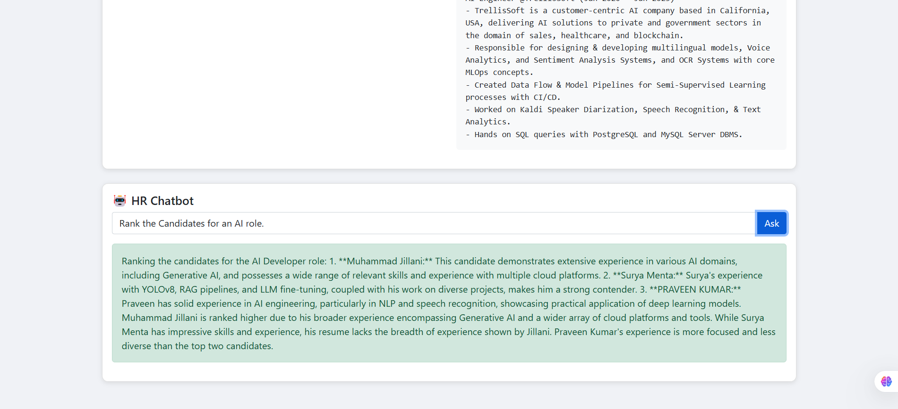
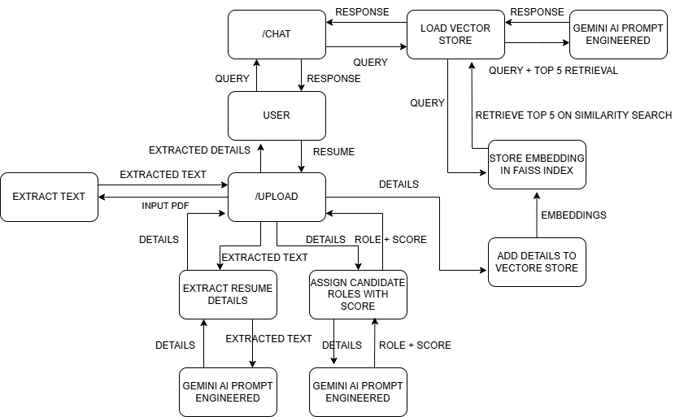

# 📄 Resume AI Extractor & HR Assistant

## 🔍 Overview

This project is an AI-powered backend system that extracts structured information from resumes/CVs using Large Language Models (LLMs). It also includes an HR assistant chatbot that helps evaluate and rank candidates based on natural language queries.

---

## 🚀 Features

- Upload multiple resumes (PDF/DOCX)
- Extracts:
  - First Name, Last Name
  - Email Address, Phone Number
  - Education History
  - Work Experience Summary
  - Skills
  - Current Position
  - Total Years of Experience
- Saves parsed data into a FAISS vector store
- Chatbot answers HR-style queries like:
  - “Who is most skilled in Python?”
  - “Rank candidates for a Full Stack Developer role.”

---

## 🛠 Technology Stack

- Python
- Flask
- LangChain + Gemini Pro
- FAISS
- HTML/CSS/JS (basic)

---

## 🧾 Setup Instructions

1. **Clone the repository**  
   ```bash
   git clone https://github.com/yourusername/Resume-Assistant.git
   ```

2. **Install dependencies**  
   ```bash
   pip install -r requirements.txt
   ```

3. **Create a `.env` file**  
   ```env
   GOOGLE_API_KEY=your_google_gemini_api_key
   ```

4. **Run the server**  
   ```bash
   python app.py
   ```

5. **Open in browser**  
   Visit: [http://127.0.0.1:5000](http://127.0.0.1:5000)

---

## 🖼 Screenshots

### Resume Extraction View


### HR Chatbot in Action



---

## 🎥 Demo Video

📺 [Watch on Google Drive](https://drive.google.com/file/d/18Gyt758KEAC_xfm9M_QmfogRR6CR-6uN/view?usp=sharing)

---

## ❗ Assumptions & Limitations

- Role tags are inferred via LLM prompts
- Only PDF/DOCX supported
- LLM accuracy depends on resume structure

---

## 🔮 Future Improvements

- Enhance role tagging logic
- Integrate real-time memory in chatbot
- Link with external ATS systems

## 🧱 AI Architecture Diagram



---
